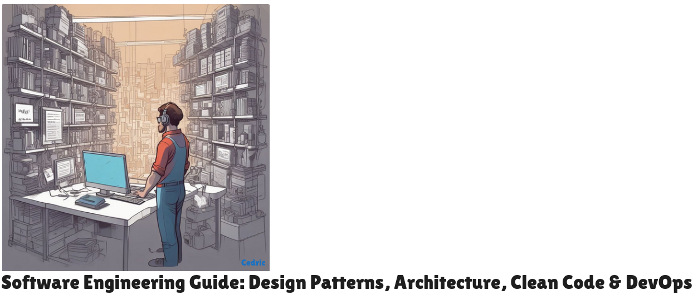

1.Install and configure Go 

2.Setup Git using these steps on your PC

$ ssh-keygen -t  ed25519 -C "cedric.kiama@gmail.com"
$ ssh-add -D
$ eval "$(ssh-agent -s)"
$ ssh-add
$ ssh -T git@github.com

3.Create the project directory

$ mkdir Golang && cd Golang
$ git clone git@github.com:cedric-kiama-wachira/Software-Engineering.git

fIXING mAIL SERVER, sOURCE BUILD DIDNT WORK I WILL DO A CLEANUP TODAY AND START FROM SCRATCH.
Decided to setup an Ubuntu 20.04 separately to install mail Server
Mail server is working as it should.
Now ensuring the mail server has enterprise grade security to it.
I think now the Mail and Web Server setup are 95% ready. Will fix it to attain 100% readiness in the comming weeks.
Reading about MCP IN ai.
Setting up an ETCD node for My K8s cluster on Hetzner cloud.
Setting up HAProxy and SSl certificate for it
Setting Up SSl via letsencrypt for ETCD nodes, hope it works.
COnfiguring SSL services further.
Letsencrypt for ETCD doesn't work, reverting to using Self Signed and see how to combine that with LetsEncrypt certificates.
Changing the configs for ssl again.

Time to get this exams:

The Curriculum of it all:

Open Source Curriculum for CNCF Certification Courses

This is the latest version of the curriculum for the following CNCF exams:

    Certified Kubernetes Administrator (CKA)
    Certified Kubernetes Application Developer (CKAD)
    Certified Kubernetes Security Specialist (CKS)
    Certified GitOps Associate (CGOA)
    Certified Argo Project Associate (CAPA)
    Certified Backstage Associate (CBA)
    Cilium Certified Associate (CCA)
    Istio Certified Associate (ICA)
    Kyverno Certified Associate (KCA)
    Kubernetes and Cloud Native Associate (KCNA)
    Kubernetes and Cloud Native Security Associate (KCSA)
    OpenTelemetry Certified Associate (OTCA)
    Prometheus Certified Associate (PCA)
    KCA: Kyverno Certified Associate
    OpenSearch and OpenSearch Dashboards
    Vendor-neutral, model-driven network management designed by users
    https://openmetrics.io/
    https://www.uber.com/en-AE/blog/migrating-ubers-compute-platform-to-kubernetes-a-technical-journey/
    https://www.securecodebox.io/docs/getting-started/installation
    https://www.keycloak.org/guides#high-availability
    https://www.youtube.com/watch?v=YM41mLZQxzE&list=PLpNYlUeSK_rnanDUNr4KiTlkLTmtqK-sQ
    https://www.youtube.com/watch?v=hINC-pmcnbg
    https://learn.mongodb.com/catalog
    https://www.timescale.com/developers
    https://valkey.io/
    https://milvus.io/docs/install_cluster-milvusoperator.md

𝗗𝗲𝘃𝗢𝗽𝘀 𝗧𝘂𝘁𝗼𝗿𝗶𝗮𝗹𝘀: Visit www.devopscube.com for hands-on DevOps tutorials

𝗙𝗿𝗲𝗲 𝗗𝗲𝘃𝗢𝗽𝘀 𝗖𝗼𝘂𝗿𝘀𝗲𝘀: Visit www.techiescamp.com for free Courses

-------lB SAME REGION
Getting the Network and Firewall plus DNS settings Correct
Installed K8s - need to fix Ciliuim
--Now there is an issue with an issue with Cilium.

Fixed it moving to add other components to my Kubernetes cluster.

Starting with the Kubernetes Dashboard, then rook-ceph for storage.
Rook-Ceph Setup DOne will activate the rest of its components tomorrow.

Added ingress-nginx and cert manager will add Gitops Stack(ArgoCd/FluxCd) plus monitoring stack

Another day confused with the next step. More things to be added here.

Have added securecodebox and trivy

want to add jenkins, sonarqube, nexus and monitoring stack.

Then deploy a postgresql and mongodb clusters Ill start with postgresql first.

Today is about ensuring rook-ceph and postgresql-timescaledb are fixed, up and running.

TodaY I Will work on implementing TimescaleDB using Patroni as an operator since cloudnativePG has issues.

adding more packages and improving the custom docker build

custom docker build is coming well, I want to add its timescaledb-toolchain and it depend on pgrx built using rust
I also need to install https://pgbackrest.org/user-guide.html  for backup and recovery and also any extensions for sharding

I think rust and golang go hand in hand. https://apt.llvm.org/

Timescaledb foundation custom image is all done.

Now I want to move to pgbackrest. DOne and the custom docker Image is aware of pgbackuprest.

Custom Image file is to large, I need to shrink it so that I can publish to my docker hub

docker login works Improved the image and published to my repo.

Let us now setup an external cephAdm Cluster.

I will rebuild the cluster a fresh.

rook-ceph external storage is done.

Time to review averything done and also ensure that the custom docker image is safe for use.

Taking a break today, eating and sleeping to recharge for tomorrow. 

Fixing Custom Image to pass the Scout Health Check on Docker Hub.

Made some changes to my home page.

Fixed Scout Health on Docker Hub and got an A. I think this is indeed very good progress

Go Development is onGoing. 

More on Go Development.

APIs and Data Structures in Golang(go)

Created a simple banner CLI program and had a deep dive into the magic of runes, Unicode, and UTF-8 encoding in Go!

Polishing up on this before I move to the next one on APIs and HTTP in Golang

Perfected the banner and still a lot of work to do on my banner code. Now I want to fetch data from publicly accessible REST api

Reading the Kubernetes document preparation for the kubestronaut exam starts now. May 23 2025 at 7:40 AM

Have started my journey on Kubernetes concepts and so far so good.

Let me switch to my coding as I will be deploying this program in my K8S.

Wrote a Golang API Program that fetches and parses data from ESPN web API.

Today Is about recap on Data Structure And APIs. Then I will start working on io.Reader and io.Writer in GO(golang).

Worked on my Website. Add more updates on the website.

Finish up the website - then implement clear cache function.

Did some improvments on my website about to make it even better

Need to finish up on a couple of things today...

Adding more services.

Docker config for K8s

code reviewing

Golang Development.

Certifications for Infrastructure Professionals:

NVIDIA-Certified Associate: AI Infrastructure and Operations (NCA-AIIO) 
NVIDIA-Certified Professional: AI Infrastructure (NCP-AII) 
NVIDIA-Certified Professional: AI Operations (NCP-AIO) 
NVIDIA-Certified Professional: AI Networking (NCP-AIN) 

Certifications for Developers:

NVIDIA-Certified Associate: Generative AI and LLMs (NCA-GENL) 
NVIDIA-Certified Associate: Multimodal Generative AI (NCA-GENM) 
NVIDIA-Certified Professional: Accelerated Data Science (NCP-ADS)

Structures, Methods and Interfaces.

Focused on Terraform and Ansible for my side project.

Terraform on Localhost is done now to implement it on Cloud.

Ongoing Ansible playbooks. Review and procedure.

