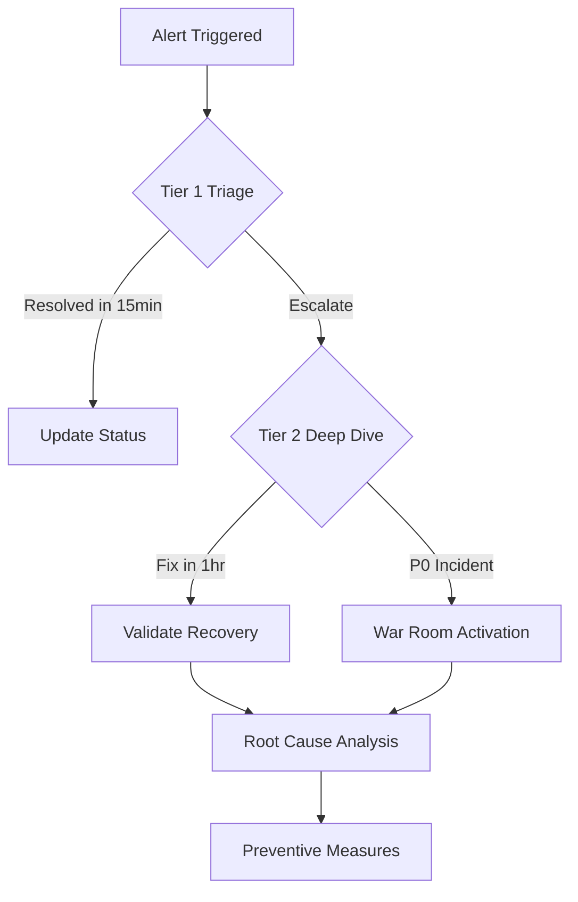

# FAANG Data Pipeline Management Plan  
**Consortium:** Apple, X.com, Meta, Airbnb  
**Effective Date:** July 23, 2025  
**Version:** 1.1  

### Revision History
| Version | Date       | Changes                     | Approved By       |
|---------|------------|-----------------------------|-------------------|
| 1.0     | 2025-07-19 | Initial version             | Consortium Leads  |
| 1.1     | 2025-07-23 | Added incident response diagram | Technical Review Board |

## Executive Summary  
This document establishes ownership, operational procedures, and reliability standards for critical data pipelines serving profit, growth, and engagement metrics across Apple, X.com, Meta, and Airbnb. The framework ensures 24/7 operational excellence with equitable responsibility distribution.

---

## Pipeline Inventory  
| Category       | Pipeline                          | Purpose                     | Criticality |
|----------------|-----------------------------------|----------------------------|-------------|
| **Profit**     | Unit-Level Profit Pipeline        | Experimentation            | P1          |
|                | Aggregate Profit Pipeline         | Investor Reporting         | P0          |
| **Growth**     | Daily Growth Pipeline             | Experimentation            | P1          |
|                | Aggregate Growth Pipeline         | Investor Reporting         | P0          |
| **Engagement** | Aggregate Engagement Pipeline     | Investor Reporting         | P0          |

---

## Ownership Structure  
### Primary/Secondary Ownership  
| Pipeline                   | Primary Owner     | Secondary Owner   | Rationale                                  |
|----------------------------|-------------------|-------------------|--------------------------------------------|
| Unit-Level Profit Pipeline | Meta Engineer     | Airbnb Engineer   | Meta's micro-transaction expertise + Airbnb's unit economics |
| Aggregate Profit Pipeline  | Apple Engineer    | X.com Engineer    | Apple's financial rigor + X.com's real-time systems |
| Daily Growth Pipeline      | X.com Engineer    | Meta Engineer     | X.com's velocity + Meta's growth infrastructure |
| Aggregate Growth Pipeline  | Airbnb Engineer   | Apple Engineer    | Airbnb's scaling experience + Apple's investor reporting |
| Engagement Pipeline        | Meta Engineer     | X.com Engineer    | Meta's engagement metrics + X.com's API ecosystem |

### Ownership Responsibilities  
- **Primary:** Architecture decisions, SLA compliance, stakeholder communication  
- **Secondary:** Deployment reviews, backup on-call, documentation updates  
- **Joint:** Quarterly pipeline reviews, incident post-mortems  

---

## On-Call Schedule  
### Rotation System  
- **4-week cycles** with 1 primary/1 secondary per week  
- **Follow-the-Sun Coverage:**  
  - AMER (PST): Apple/Airbnb  
  - EMEA (GMT): X.com  
  - APAC (HKT): Meta  

| Week | Primary On-Call | Secondary On-Call | Backup       |
|------|-----------------|-------------------|--------------|
| 1    | Apple           | Airbnb            | X.com        |
| 2    | X.com           | Meta              | Apple        |
| 3    | Meta            | Apple             | Airbnb       |
| 4    | Airbnb          | X.com             | Meta         |

### Holiday Protocol  
1. **Compensation:**  
   - Standard: 1.5x hourly rate  
   - Holidays: 3x hourly rate + comp day
   - **Minimum Staffing:** At least 2 engineers on-call during holidays
2. **Blackout Periods:** Dec 24-26, Jan 1-2 (skeleton crew only)  
3. **Holiday Swap:** Voluntary exchange portal with seniority caps  

---

## Investor Pipeline Runbooks  
### Critical SLAs  
| Pipeline               | Freshness | Accuracy  | Availability |
|------------------------|-----------|-----------|--------------|
| Aggregate Profit       | <4 hrs    | 99.99%    | 99.9%        |
| Aggregate Growth       | <6 hrs    | 99.9%     | 99.5%        |
| Aggregate Engagement   | <6 hrs    | 99.95%    | 99.5%        |

### Failure Scenarios & Mitigation  
**Aggregate Profit Pipeline**  
| Failure Mode              | Detection Method               | Severity | Impact                      |
|---------------------------|--------------------------------|----------|-----------------------------|
| Schema Drift              | Schema validation alerts       | P0       | Pipeline halt               |
| FX Rate Missing           | Null check in currency fields  | P1       | Incomplete regional revenue |
| Duplicate Transactions    | Deduplication failure alerts   | P0       | Revenue inflation           |

**Aggregate Growth Pipeline**  
| Failure Mode              | Detection Method               | Severity | Impact                      |
|---------------------------|--------------------------------|----------|-----------------------------|
| Attribution Window Error  | Cohort size anomaly detection  | P1       | Inaccurate growth rates     |
| Bot Traffic Inclusion     | Traffic pattern analysis       | P1       | Artificial growth inflation |
| Geo Data Loss             | Null region counts             | P2       | Incomplete market analysis  |

**Engagement Pipeline**  
| Failure Mode              | Detection Method               | Severity | Impact                      |
|---------------------------|--------------------------------|----------|-----------------------------|
| Session Boundary Failure  | Duration outlier detection     | P1       | Metric distortion           |
| API Throttling            | Source system health checks    | P2       | Data gaps                   |
| Consent Filter Failure    | Privacy compliance audits      | P0       | Regulatory risk             |

---
```markdown
## Incident Response Protocol  
### Critical Path (All Pipelines) 

### Communication Framework  
- **<30min Delay:** #pipeline-alerts channel update  
- **>1hr Delay:** Stakeholder email blast  
- **>2hr Delay:** Executive briefing + mitigation plan  

---

## Best Practices  
### Change Management  
- **Deployment Windows:** Tue-Thu, 10am-2pm owner timezone  
- **Testing Mandates:**  
  - 100% unit test coverage for critical transforms  
  - 48h shadow run in staging environment  
- **Rollback Protocol:** Automated version snapshots with 1-click revert  

### Knowledge Preservation  
- **Monthly:** Cross-company architecture review  
- **Quarterly:** Failure scenario simulation drills  
- **Biannual:** Ownership rotation with 2-week overlap  

---

## Appendix  
### Contact Registry  
| Company  | Primary Contact | Backup Contact | Escalation Path       |
|----------|-----------------|----------------|-----------------------|
| Apple    | [Name/Email]    | [Name/Email]   | SVP Data Platform     |
| X.com    | [Name/Email]    | [Name/Email]   | Head of Data Eng      |
| Meta     | [Name/Email]    | [Name/Email]   | Director Analytics    |
| Airbnb   | [Name/Email]    | [Name/Email]   | CTO Office Liaison    |

| Role              | Contact Method         |
|-------------------|------------------------|
| Security Escalation | security@faang-consortium.org |

### Document Governance  
- **Review Cadence:** Quarterly  
- **Version Control:** GitHub Enterprise  
- **Approvers:** All primary owners + Legal  
- **Confidentiality:** Tier 4 - FAANG Consortium Only

